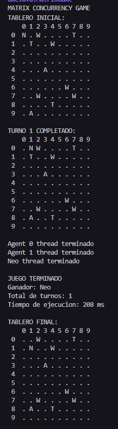
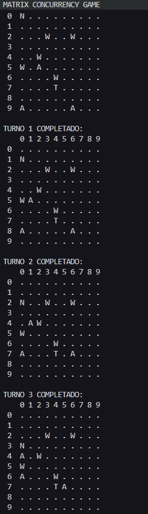
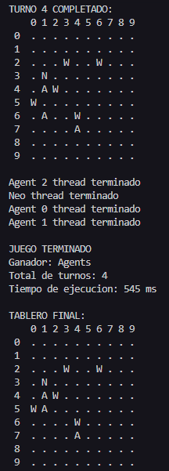

# Matrix Concurrency Game

## Descripción General

Matrix Concurrency Game es una simulación inspirada en la saga de Matrix, donde Neo debe llegar a un teléfono para escapar, mientras agentes intentan capturarlo. El juego se desarrolla en un tablero representado por una matriz, y utiliza concurrencia para manejar los movimientos simultaneos de Neo y los agentes.

## Objetivo del Juego
- **Neo**: Su objetivo es llegar a cualquier teléfono del tablero para ganar.
- **Agentes**: Su objetivo es capturar a Neo antes de que llegue a un teléfono.

## Elementos del Tablero
- `N`: Neo
- `A`: Agente
- `T`: Teléfono
- `W`: Pared
- `.`: Espacio vacío

## Reglas del Juego
- Neo y los agentes se mueven por turnos
- Neo siempre intenta acercarse al teléfono más cercano, evitando paredes.
- Los agentes persiguen a Neo.
- Si Neo llega a un teléfono, gana el juego.
- Si un agente alcanza la posición de Neo, los agentes ganan.
- Los movimientos no pueden atravesar paredes ni salirse del tablero.

## Estrategia de Concurrencia y Sincronización

### 1. Modelo de Concurrencia: Hilos Independientes

El juego implementa un **modelo de múltiples hilos** donde cada personaje opera de forma independiente:

- **NeoThread**: Hilo dedicado que controla los movimientos de Neo
- **AgentThread**: Un hilo por cada agente
- **Ejecución paralela**: Todos los hilos se inician simultáneamente y ejecutan su lógica en paralelo

```java
// Creación de hilos en MatrixGame.java
NeoThread neoThread = new NeoThread(board);
for (int i = 0; i < numAgents; i++) {
    AgentThread agentThread = new AgentThread(board, i, agentPos);
}
```

### 2. Sincronización del Tablero: ReentrantLock

El recurso compartido es el **tablero de juego** (`Board`), que todos los hilos necesitan leer y modificar. Para evitar condiciones de carrera, se implementa:

**Mecanismo**: `ReentrantLock`
```java
private final Lock lock = new ReentrantLock();
```

**Beneficios**:
- **Exclusión mutua**: Solo un hilo puede modificar el tablero a la vez
- **Equidad**: Los hilos obtienen el lock en orden de llegada, evitando inanición
- **Flexibilidad**: Permite uso de Conditions para coordinación avanzada

### 3. Coordinación por Turnos: Condition Variables

Para simular un sistema de **turnos sincronizados**, se implementa un mecanismo de barrera usando `Condition`:

**Variables de control**:
```java
private final Condition turnCondition = lock.newCondition();
private int movesDoneInCurrentTurn = 0;  // Contador de movimientos
private final int totalMovers;            // Neo + todos los agentes
```

**Flujo de sincronización**:
1. Cada hilo adquiere el lock antes de mover
2. Si el turno anterior no ha terminado (`movesDoneInCurrentTurn >= totalMovers`), el hilo **espera**:
   ```java
   turnCondition.await();  // Libera el lock y espera
   ```
3. Cuando un hilo completa su movimiento, incrementa `movesDoneInCurrentTurn`
4. Si todos han movido, se resetea el contador y se **notifica** a todos:
   ```java
   if (movesDoneInCurrentTurn >= totalMovers) {
       movesDoneInCurrentTurn = 0;
       currentTurn++;
       turnCondition.signalAll();  // Despertar a todos los hilos
   }
   ```

**Resultado**: Todos los personajes mueven "simultáneamente" dentro de cada turno, pero de forma ordenada y segura.

### 4. Gestión del Estado del Juego: Volatile

Las variables de estado compartidas usan el modificador `volatile` para garantizar **visibilidad inmediata** entre hilos:

```java
private volatile boolean gameOver = false;
private volatile String winner = null;
```

**¿Por qué volatile?**:
- Cada hilo ve el valor actualizado en memoria principal
- Los hilos consultan `gameOver` en cada iteración de su bucle principal
- Cuando un hilo cambia `gameOver = true`, todos los demás hilos lo ven inmediatamente y terminan

### 5. Acceso Seguro a Datos Compartidos

Todos los métodos que acceden a datos del tablero están **protegidos por el lock**:

```java
public Position getNeoPosition() {
    lock.lock();
    try {
        return neoPosition;
    } finally {
        lock.unlock();  // Garantiza liberación incluso con excepciones
    }
}
```

### 6. Método Central: moveCharacter()

Este método encapsula toda la lógica de sincronización:

```java
public boolean moveCharacter(Position from, Position to, CellType type, int agentIndex) {
    lock.lock();
    try {
        // 1. Esperar si el turno no ha comenzado
        while (movesDoneInCurrentTurn >= totalMovers && !gameOver) {
            turnCondition.await();
        }
        
        // 2. Verificar fin del juego
        if (gameOver) return false;
        
        // 3. Validar y ejecutar movimiento
        // ... lógica de movimiento ...
        
        // 4. Incrementar contador
        movesDoneInCurrentTurn++;
        
        // 5. Verificar si el turno completó
        checkTurnComplete();
        
        return true;
    } finally {
        lock.unlock();
    }
}
```

### 7. Prevención de Problemas de Concurrencia

| Problema | Solución Implementada |
|----------|----------------------|
| **Race Conditions** | ReentrantLock protege todas las operaciones sobre el tablero |
| **Deadlock** | Se evita al usar un solo lock y patrones try-finally |
| **Inanición** | ReentrantLock con equidad garantiza acceso justo |
| **Visibilidad** | Variables volatile para estado del juego |
| **Desincronización** | Sistema de turnos con Condition para coordinación |

### 8. Flujo de Ejecución Completo

1. **Inicio**: Se crean y lanzan N+1 hilos (Neo + Agentes)
2. **Ciclo de cada hilo**:
   - Calcular mejor movimiento (lógica local, sin bloqueo)
   - Adquirir lock
   - Esperar turno si es necesario
   - Ejecutar movimiento si el juego continúa
   - Incrementar contador y verificar fin de turno
   - Liberar lock
4. **Visualización**: En cada turno, el tablero se imprime mostrando las posiciones actuales
3. **Terminación**: Cuando `gameOver = true`, todos los hilos salen del bucle
4. **Join**: El hilo principal espera a que todos terminen con `thread.join()`

### 9. Ejemplo de salida de ejecución:  
  
#### Caso en donde gana neo:  

  

#### Caso en donde ganan los agentes:

  
